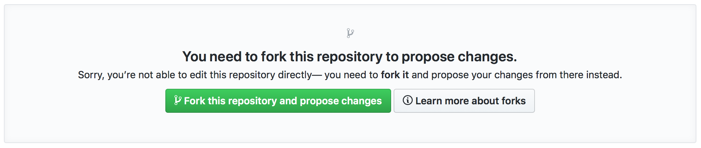
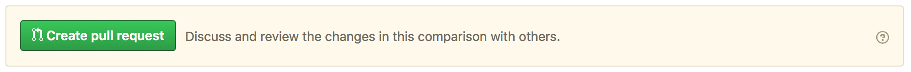

<a name="top"/>

# Procedure for the proposal, review, and acceptance of Astropy-affiliated packages

This document describes the procedure for proposing, reviewing, and making a
decision about Astropy-affiliated packages. This is meant as a record of the
procedure and not the first place people should go to - for instructions
on proposing an affiliated package, see
[**Becoming an Affiliated Package**](http://www.astropy.org/affiliated/index.html).

* [Proposing an affiliated package](#proposing)
* [Reviewing affiliated packages](#reviewing)
* [Templates](#templates)
    * [Template email with review request](#templatereviewrequest)
    * [Template email with review instructions](#templatereviewinstructions")
    * [Template markdown with review result](#templatereviewresult)

<a name="proposing"/>

## Proposing an affiliated package

*These instructions are for affiliated package authors*

Once you believe your package is ready to be reviewed by the
Astropy Project, open a pull request to the
[astropy.github.com](https://github.com/astropy/astropy.github.com)
repository, modifying the ``affiliated/registry.json`` file to add details
about your own package. If you are not comfortable with git, you can do this by using
[an editor](https://github.com/astropy/astropy.github.com/edit/master/affiliated/registry.json).
If you get a message saying **You need
to fork this repository to propose changes** then click on the green button
to confirm the forking:

<p align="center">
  
</p>

Copy the following template entry and fill out the
details:

    {
      "name": "Your package name",
      "maintainer": "Your name <your email address>",
      "stable": true,
      "home_url": "URL to the home page or documentation",
      "repo_url": "URL to the repository",
      "pypi_name": "PyPI name if it exists, set to an empty string otherwise",
      "description": "A few sentence description of your package",
      "review": {
         "functionality": "To be filled out by the reviewer",
         "ecointegration": "To be filled out by the reviewer",
         "documentation": "To be filled out by the reviewer",
         "testing": "To be filled out by the reviewer",
         "devstatus": "To be filled out by the reviewer",
         "python3": "To be filled out by the reviewer",
         "last-updated": "To be filled out by the reviewer"
      }
    },

then add it at the top of the ``registry.json`` file, starting on line 3,
after:

    {
      "packages": [

Once this is done, under **Propose file change** you can enter a short
description for the commit then click on the green **Propose file change**
button:

<p align="center">
  
</p>

On the next screen, check the changes you made, and click on the green
**Create pull request** button:

<p align="center">
  
</p>

Finally, give a title to the pull request such as **Proposed affiliated
package: your package name** and include a short description of the
package, then click on **Create pull request**:

<p align="center">
  
</p>

Once this is done, send an email to https://groups.google.com/forum/#!forum/astropy-dev
(which is the main developer list) to introduce your package and say that
you would like it to be considered as an affiliated package. Make sure you
include a link to the pull request you opened above. Once you've done this,
you're all set! The next steps are the review, for which the results will be
posted on the pull request and also in a reply to your email.

<a href="#top">Back to top</a>

<a name="reviewing"/>

## Reviewing affiliated packages

*These instructions are for editors and reviewers.*

The review process will be overseen and coordinated by the individuals that are in
the *Affiliated package review editor* role. This role
may be filled by one or more individuals. For the rest of this section, we
use the singular term *editor*, although multiple people may share this role
(and it is at their discretion to decide how to divide up work). The
editor will start off by finding someone to carry out the main review of the
package (hereafter the *reviewer*). In this sense the role of the editor is
similar to that of a journal editor (and hence the role name). However this analogy
is only partially accurate, because here the editor may add their views to the review,
unlike a journal editor who is often strictly impartial on the review itself.
The pool of available reviewers will be anyone who has an official role on [the
Astropy team](http://www.astropy.org/team.html) or anyone who has participated
in the Astropy project enough to be familiar with the project guidelines and requirements.
In some cases, it may be necessary to have multiple reviewers depending on the
expertise required, and if scientific or algorithmic expertise is needed which
is not available in the project, reviewers can be requested from outside the
project at the editor's discretion.

The editor sends out an email to possible reviewers to find someone who is
willing to review the package, using the template at the bottom of this
document. Emails should only be sent to the next potential reviewer(s) - not
many possible reviewers at the same time. The editor should let the potential
reviewer know at this point that the editor may also be doing a review and
synthesizing the results into a single review. Once a reviewer accepts, the
editor sends them an email with detailed review instructions (which includes a link to the
[review guidelines](https://github.com/astropy/project/blob/master/affiliated/affiliated_package_review_guidelines.md>)),
using the template at the bottom of this document. The editor then leaves a
message on the pull request proposing the affiliated package saying:

*Thank you for proposing this package as an affiliated package! I'm happy to
confirm that your package is now under review and we'll post the results of
the review here and on the mailing list.*

Once the reviewer has finished, they send their review back by email to the
editor, who then does their own review if needed and then writes up a review
using the review template which includes a table with badges (template at the
bottom of this document). At this point, the editor makes a decision to accept
or reject the package based on the results of the review. If no objections or
concerns are raised, the editor then posts the review including the final
decision (accept or reject) on the original pull request. If the package is
rejected, the original author has a month to respond to any of the points in the
review, and the editor may decide to change the decision.

If the package is accepted, the editor sends a reply to the astropy-dev
email to publish the decision, then also edits the pull request to add the
results to the review to the JSON file. Once the continuous integration passes,
the pull request is merged.

If the package is rejected, the decision is posted to the pull request, and the
pull request is closed.

<a href="#top">Back to top</a>

<a name="templates"/>

## Templates

<a name="templatereviewrequest"/>

### Template email with review request

Subject: Reviewing an Astropy-affiliated package submission

Hi {potential reviewer},

The Astropy project has received a request to consider the following as an
affiliated package:

Name:

Description:

Repository:

Documentation:

I am reaching out to ask whether you would be willing to review this package.

To provide some background, an affiliated package is an astronomy-related Python
package that is not part of the astropy core package, but is part of the Astropy
Project community. Such as package demonstrate a commitment to Astropy’s goals
of improving reuse, interoperability, and interface standards for Python
astronomy and astrophysics packages.

Reviewing a package involves reading over the documentation, having a look at
the code to assess for example readability (but not read it line by line),
checking how well the package is tested, as well as assessing its integration
with the Astropy and wider astronomy ecosystem. Most packages can be reviewed
within an hour and reviews are anonymous by default (unless you indicate that you
are happy for your identity to be revealed). If you accept this review,
we will send you a detailed list of criteria to check for the package as well as
how to submit your review.

Could you reply to this email to let us know if you would be willing to review
this package? Please also let us know if you feel you may have a conflict of
interest in reviewing this package.

Thanks!

{editor name}

<a href="#top">Back to top</a>

<a name="templatereviewinstructions"/>

### Template email with review instructions

Hi {reviewer name},

Thank you for accepting to review the following package for the Astropy project:

Name:

Description:

Repository:

You can find our review guidelines and instructions at the following address:

  https://github.com/astropy/project/blob/master/affiliated/affiliated_package_review_guidelines.md

Thanks!

{editor name}

<a href="#top">Back to top</a>

<a name="templatereviewresult"/>

### Template markdown with review result

```
This package has been reviewed for inclusion in the Astropy affiliated package
ecosystem by a member of the Astropy community as well as myself, and I have
synthesized the results of the review here.

You can find out more about our review criteria in
[Reviewing affiliated packages](https://github.com/astropy/astropy-procedures/blob/master/documents/affiliated_package_review_guidelines.md).
For each of the review categories below we have listed the score and have
included some comments when the score is not green.

*Remove the badges that aren't needed:*

<table>
<tr><td><b>Functionality/Scope</b></td><td>
<a href="https://github.com/astropy/astropy-procedures/blob/master/documents/affiliated_package_review_guidelines.md#functionality-functionality">


</a></td></tr>

<tr><td colspan=2><i>No further comments</i></td></tr>

<tr><td><b>Integration with Astropy ecosystem</b></td><td>
<a href="https://github.com/astropy/astropy-procedures/blob/master/documents/affiliated_package_review_guidelines.md#integration-with-astropy-ecosystem--ecointegration">


</a></td></tr>

<tr><td colspan=2><i>No further comments</i></td></tr>

<tr><td><b>Documentation</b></td><td>
<a href="https://github.com/astropy/astropy-procedures/blob/master/documents/affiliated_package_review_guidelines.md#documentation-documentation">


</a></td></tr>

<tr><td colspan=2><i>No further comments</i></td></tr>

<tr><td><b>Testing</b></td><td>
<a href="https://github.com/astropy/astropy-procedures/blob/master/documents/affiliated_package_review_guidelines.md#testing-testing">


</a></td></tr>

<tr><td colspan=2><i>No further comments</i></td></tr>

<tr><td><b>Development status</b></td><td>
<a href="https://github.com/astropy/astropy-procedures/blob/master/documents/affiliated_package_review_guidelines.md#development-status-devstatus">


</a></td></tr>

<tr><td colspan=2><i>No further comments</i></td></tr>

<tr><td><b>Python 3 compatibility</b></td><td>
<a href="https://github.com/astropy/astropy-procedures/blob/master/documents/affiliated_package_review_guidelines.md#python-3-compatibility-python3">


</a></td></tr>

<tr><td colspan=2><i>No further comments</i></td></tr>

</table>

*Include any other comments here*

*If accepted with all green:*

**Summary/Decision**: Everything looks great, and we're happy to confirm that
this package is accepted as an affiliated package! :trophy:

*If accepted with some orange:*

**Summary/Decision**: This package meets the review criteria for affiliated
packages, so we are happy to confirm that we'll be listing your package as an
affiliated package! Keep up the good work, and we encourage you to improve on
the areas above that weren't “green” yet.

*If there is any red:*

**Summary/Decision**: Thanks for your work on this package! At the moment, we
found some issues in some of the review areas. As per the review guidelines, we
therefore won't be able to accept this package as an affiliated package yet.
We will leave this pull request open for a month in case you would like to
respond to the comments and/or address any of them.

*In all cases:*

If you have any follow-up questions or disagree with any of the comments above,
leave a comment and we can discuss it here. At any point in future you can
request a re-review of the package if you believe any of the scores should be
updated - contact the coordination committee, and we’ll do a new review.
```

<a href="#top">Back to top</a>