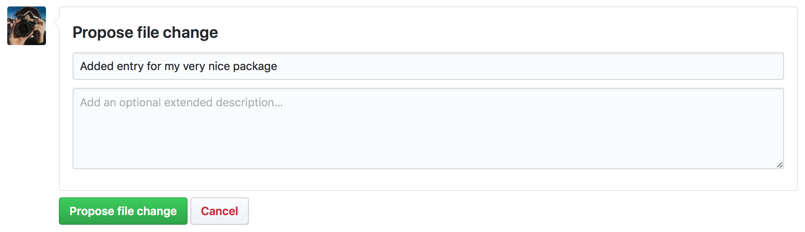
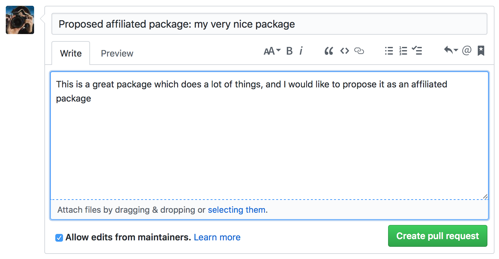

 # Procedure for the proposal, review, and acceptance of Astropy-affiliated packages

This document describes the procedure for proposing, reviewing, and making a
decision about Astropy-affiliated packages. This is meant as a record of the
procedure and not the first place people should go to for - for instructions
on proposing an affiliated package, see **Becoming an Affiliated Package** on
[this](http://www.astropy.org/affiliated/index.html) page.

## Proposing an affiliated package

*Note that tthis section is for affiliated package authors*

Once you believe your package is ready to be reviewed by the
Astropy Project, you should open a pull request to the
[astropy.github.com](https://github.com/astropy/astropy.github.com)
repository, modifying the ``affiliated/registry.json`` file to add details
about your own package. If you are not comfortable with git, you can do this
easily by accessing [this
link](https://github.com/astropy/astropy.github.com/edit/master/affiliated/registry.json)
which takes you directly to an editor. If you get a message saying **You need
to fork this repository to propose changes** then click on the green button
to confirm the forking:

  

Copy the following template entry and fill out the
details:

    {
      "name": "Your package name",
      "maintainer": "Your name <your email address>",
      "stable": true,
      "home_url": "URL to the home page or documentation",
      "repo_url": "URL to the repository",
      "pypi_name": "PyPI name if it exists, set to an empty string otherwise",
      "description": "A few sentence description of your package",
      "review": {
         "functionality": "To be filled out by the reviewer",
         "ecointegration": "To be filled out by the reviewer",
         "documentation": "To be filled out by the reviewer",
         "testing": "To be filled out by the reviewer",
         "devstatus": "To be filled out by the reviewer",
         "python3": "To be filled out by the reviewer",
         "last-updated": "To be filled out by the reviewer"
      }
    },

then add it at the top of the ``registry.json`` file, starting on line 3,
after:

    {
      "packages": [

Once this is done, under **Propose file change** you can enter a short
description for the commit then click on the green **Propose file change**
button:

  

On the next screen, check the changes you made, and click on the green
**Create pull request** button:

  

Finally, give a title to the pull request such as **Proposed affiliated
package: your package name** and include a short description of the
package, then click on **Create pull request**:

  

Once this is done, send an email to https://groups.google.com/forum/#!forum/astropy-dev
(which is the main developer list) to introduce your package and say that
you would like it to be considered as an affiliated package. Make sure you
include a link to the pull request you opened above. Once you've done this,
you're all set! The next steps are the review, for which the results will be
posted on the pull request and also in a reply to your email.

## Reviewing affiliated packages

*These instructions are for coordinators and reviewers*

One of the coordination committee members will be in charge of the review
process (not necessarily the same person for each package). This coordination
committee member (hereafter the *coordinator*) will find someone to carry out
the main review of the package (hereafter the *reviewer*). In this sense the
role  of the coordinator is similar to that of a journal editor.  However
this is only partially true, because the coordinator (speaking for the
coordination committee as a whole) may add their views to the review, unlike a
journal editor who is often strictly impartial on the review itself.
The pool of available reviewers will be anyone who has an official role on
[the Astropy team](http://www.astropy.org/team.html).

The coordinator sends out an email to possible reviewers one at a time to find
someone who is willing to review the package, using the template at the bottom
of this document. Let them know at this point that the coordinator will also be
doing a review and synthesizing the results into a single review. Once a
reviewer accepts, the coordinator sends them an email with detailed review
instructions, using the template at the bottom of this document. The coordinator
then leaves a message on the pull request saying:

*Thank you for proposing this package as an affiliated package! I'm happy to
confirm that your package is now under review and we'll post the results of
the review here and on the mailing list.*

Once the reviewer has finished, they send their review back by email to the
coordinator, who then does their own review and then writes up a review using
the review template which includes a table with badges (template at the bottom
of this document). They then share it with the other coordination committee
members to check for consensus. The review including the final decision (accept
or reject) is then posted on the original pull request. If the package is
rejected, the original author has a month to respond to any of the points in the
review, and the coordinator may decide to change the decision.

If the package is accepted, the coordinator sends a reply to the astropy-dev
email to publish the decision, then also edits the pull request to add the
results to the review to the JSON file. Once the continuous integration passes,
the pull request is merged.

If the package is rejected, the decision is posted to the pull request, and the
pull request is closed.

## Templates

### Template email with review request

Dear/Hi <potential reviewer>

The Astropy project has received a request to consider the following as an
affiliated package:

Name:
Description:
Repository:

I am reaching out to ask whether you would be willing to review this package.

To provide some background, an affiliated package is an astronomy-related Python
package that is not part of the astropy core package, but is part of the Astropy
Project community. Such as package demonstrate a commitment to Astropy’s goals
of improving reuse, interoperability, and interface standards for Python
astronomy and astrophysics packages.

Reviewing a package involves reading over the documentation, having a look at
the code to assess for example readability (but not read it line by line),
checking how well the package is tested, as well as assessing its integration
with the Astropy and wider astronomy ecosystem. Most packages can be reviewed
within an hour. If you accept this review, we will send you a detailed list of
criteria to check for the package as well as how to submit your review.

Could you reply to this email to let us know if you would be happy to review
this package?

Thanks!
<coordinator name>

### Template email with review instructions

Dear/Hi <review name>,

Thank you for accepting to review the following package for the Astropy project:

Name:
Description:
Repository:

<review guidelines from https://github.com/astropy/astropy-procedures/blob/master/documents/affiliated_package_review_guidelines.md here>

### Template review markdown
