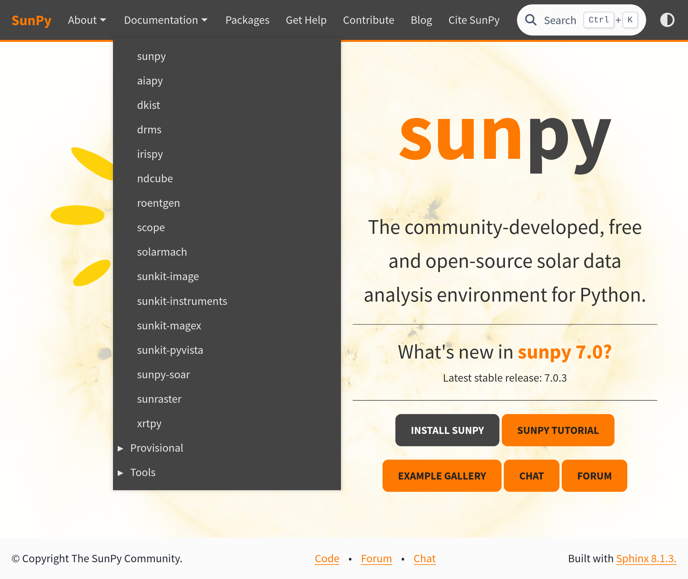
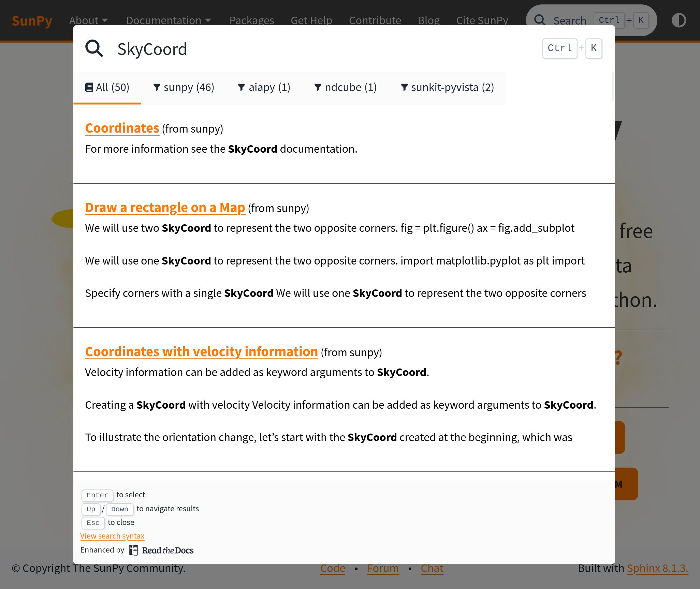

### Improve Integration of Astropy Documentation

### Project Team
This proposal is primarily to fund Stuart Mumford at [Aperio Software](https://aperiosoftware.com).
This could also fund other individuals working at Aperio Software as required.

### Project Description

This proposal is to deploy a unified theme across (at minimum) all Coordinated Packages, core and astropy.org.
This theme will allow navigation between these different sites, and search across all of them.

#### Roadmap Items

List which [roadmap](https://github.com/astropy/astropy-project/blob/main/roadmap/roadmap.md) item(s) this work will help address?

This proposal will primarily address:

* 🔶 Improve integration of core package and coordinated package documentation from a user perspective (e.g., joint search functionality).

But also in part:

* 🟥 Update Astropy website to reflect the Project as a whole, not just the core package.

#### Project Summary

SunPy has developed a derviative of the pydata sphinx theme (which astropy core uses), which makes a few key changes.
The main ones of interest to Astropy are:

##### A Global top navigation bar

The theme enables a top navigation bar to be defined in the Sphinx config. This means that all websites using the SunPy sphinx theme have the same top navigation bar, allowing you to jump between projects and key information.

As can be seen by this screenshot of the [sunpy.org](https://sunpy.org) home page, SunPy uses this top bar to link to key information about the project, as well as all the documentation of all affiliated packages.

**We shall implement a similar configuration for astropy**, where all the affiliated package documentation is linked, and other important links such as community participation, contributing etc are also linked.

##### A Cross-Project Search

The SunPy sphinx theme also has a custom search implementation which makes use of the [Read the Docs API](https://docs.readthedocs.com/platform/stable/server-side-search/api.html) for Server Side Search.
This is also configurable from the sphinx config, but by default it searches all the projects listed in the documentation dropdown.

This functionality will enable all projects that host their docs on Read the Docs to be included in this search.
(If the RTD API fails for any reason it falls back to sphinx default search).

##### Tasks

To achieve integration with the SunPy sphinx theme and the coordinated affiliated packages the following tasks will be undertaken:

- Add an astropy config for the sunpy-sphinx-theme to [sphinx-astropy](https://github.com/astropy/sphinx-astropy) so all packages can import the shared config from there.
- Rebuild the astropy.org site to be a sphinx project and move it's hosting to read the docs.
- Migrate all affiliated packages to the new theme, making any tweaks for navigation changes where appropriate.

I expect the largest component of this work to be the migration of astropy.org to sphnix & Read the Docs.
To keep the budget for this project low, I am proposing to use the SunPy sphinx theme as it is, with minimal modifications, I believe that this will address the needs of Astropy for only a small amount of work.

### Approximate Budget

Currency: US $6,000 = 40h x $150/hour

### Period of Performance

To allow some flexibility in when I schedule this work, I would ask for the period of performance to between 1st Jan and 31st May.
